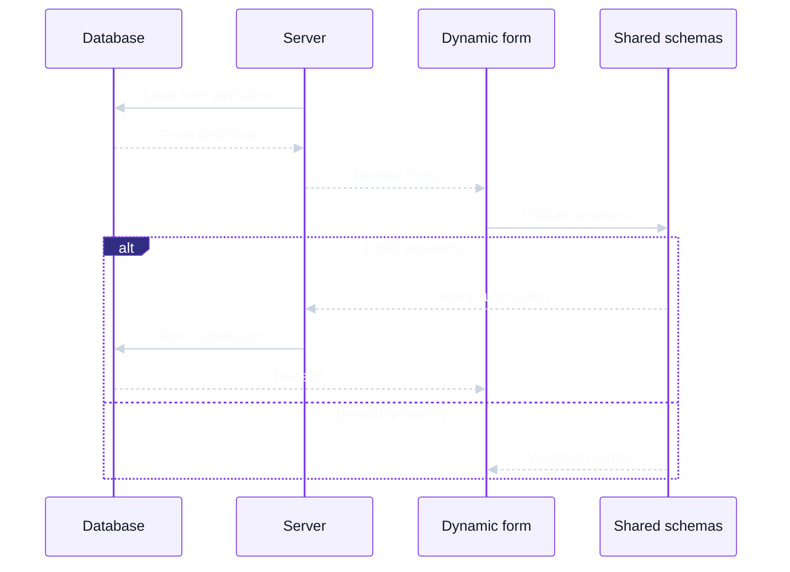

# Open Ed Dynamic Forms

This Next.js sample demonstrates a data-driven school forms workflow. Form definitions live in an in-memory database and are loaded by the server to build a shared dynamic form UI. When a form is submitted, shared schemas validate the answers before the submission is stored in the same in-memory database.



## Project structure

```text
.
├── app/                     Next.js app router routes
├── components/
│   ├── lib/                 shared component utilities
│   └── ui/                  shared UI primitives
├── public/                  static assets
├── services/
│   ├── internal/            in-memory database and form seed data
│   ├── server/              server-side functionality
│   └── universal/           shared utils for both client and server
│       ├── form/            form domain types, schemas, and validation
│       └── grade-levels.ts  shared grade choices
└── tests/                   shared test setup and utilities
```

## Development

Requires `node` and `pnpm`

```sh
pnpm install
pnpm dev      # Run development server
```

Open [http://localhost:3000](http://localhost:3000).

```sh
pnpm test       # Run tests
pnpm typecheck  # Check TypeScript
pnpm lint       # Run ESLint
pnpm build      # Build for production
pnpm start      # Serve the production build
```

## Approach

I started with a mini design system using ShadCN to make the project feel as polished as possible. For loading forms, I opted to us a query param to select the form so it can be linked to directly. The page loads the selected form on the server, then hands the definition off to a generic renderer using React Hook Form. We use the same Zod schemas on both sides, and validate again on the server before saving. I stubbed out an ORM-esque in-memory "database" to try to make the service layer feeling as much like a real implementation as possible.

## What did you prioritize?

- Getting the full flow working: choose a form, load its definition, fill it out, submit it, and get a receipt
- Making the feature feel polished and accessible: ShadCN components.
- I wanted the renderer to handle interesting form types with groups, repeaters, and conditional fields without knowing which form it was rendering.
- Blocking invalid submissions a making sure failed submissions wouldn't wipe out users' answers.

## What did you deliberately leave out?

- A proper database, and a UI for creating form definitions. Definitions are seeded from code, and submissions live in a single server process's memory and disappear on restart. The storage interface gives us a place to swap in a real DB later.
- Authentication: the submission lookup API endpoint I added is for the sample and doesn't enforce ownership.

## What would you do next with more time?

- Look further into keeping definitions and schemas together. Ideally we'd store the schema with the definition, but I hit limitations with Zod's schema conversion for the conditional and cross-field rules I used. For now, the definitions and code schemas need to be kept in sync.
- Make another full pass at a11y and the different scenarios these features support, especially keyboard navigation, validation focus, and the choice controls.
- Clean up the submission and navigation state. It's shared by too many things at present, and its ownership should be consolidated.
