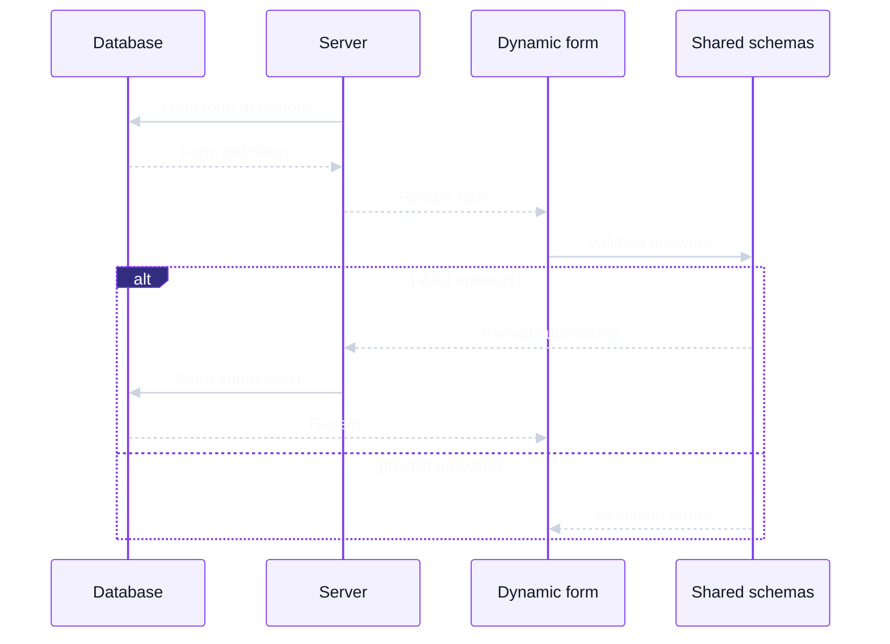

# Open Ed Dynamic Forms

This Next.js sample demonstrates a data-driven school forms workflow. Form definitions live in an in-memory database and are loaded by the server to build a shared dynamic form UI. When a form is submitted, shared schemas validate the answers before the submission is stored in the same in-memory database.



## Project structure

```text
.
├── app/                     Next.js app router routes
├── components/
│   ├── lib/                 shared component utilities
│   └── ui/                  shared UI primitives
├── public/                  static assets
├── services/
│   ├── internal/            in-memory database and form seed data
│   ├── server/              server-side functionality
│   └── universal/           shared utils for both client and server
│       ├── form/            form domain types, schemas, and validation
│       └── grade-levels.ts  shared grade choices
└── tests/                   shared test setup and utilities
```

## Development

Requires `node` and `pnpm`

```sh
pnpm install
pnpm dev      # Run development server
```

Open [http://localhost:3000](http://localhost:3000).

```sh
pnpm test       # Run tests
pnpm typecheck  # Check TypeScript
pnpm lint       # Run ESLint
pnpm build      # Build for production
pnpm start      # Serve the production build
```
